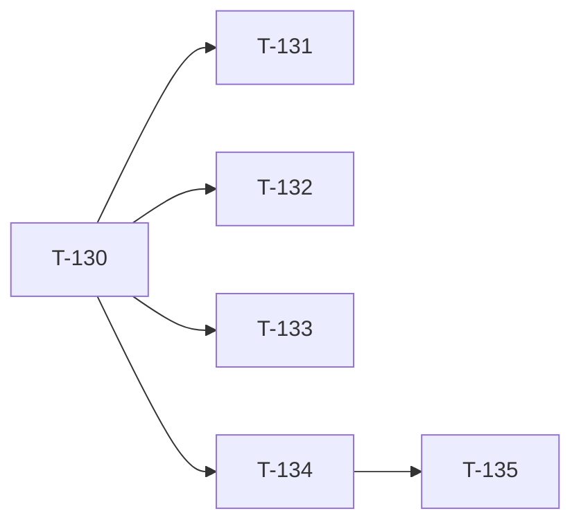

# Build Site — Batch 10 Follow-up

Small follow-up batch addressing the inspector findings from Batch 9: P1 CSS injection in shadow exports, two coverage GAPs (export emission tests, integration tests), and the kpi-tile metric variant UX decision.

**6 tasks across 3 tiers.** Task IDs T-130..T-135.

---

## Tier 0 — Schema tightening + cavekit revisions (start here)

| Task | Title | Cavekit | Requirement | Effort |
|------|-------|---------|-------------|--------|
| T-130 | Tighten `cssShadow` validator: reject `;` `}` `{` `/*` `*/` newlines `<` `>` | cavekit-schema.md | R8 (revised) | S |

---

## Tier 1 — Coverage GAPs

| Task | Title | Cavekit | Requirement | blockedBy | Effort |
|------|-------|---------|-------------|-----------|--------|
| T-131 | Export-emission tests for new tokens (CSS / SCSS / Tailwind / Style Dictionary all assert `--color-*` 5 new + `--shadow-*` 4 + `--radius-*` 5; Variant counterparts too) | cavekit-export.md, cavekit-widgets.md | R5 | T-130 | M |
| T-132 | Integration tests: `toJSON` round-trip includes shadows + radii; preset apply changes the root style attribute and downstream `WidgetPreview` reads the new vars | cavekit-persistence.md, cavekit-widgets.md | R6, R4 | T-130 | M |
| T-133 | Shadow injection regression test: persisted-record load with `;` / `}` / `<` in shadow value is treated as corrupt | cavekit-schema.md | R8 (revised), cavekit-persistence.md | T-130 | S |

---

## Tier 2 — kpi-tile variant UX

| Task | Title | Cavekit | Requirement | blockedBy | Effort |
|------|-------|---------|-------------|-----------|--------|
| T-134 | Add in-card variant toggle to kpi-tile preview (Tile / Metric pills, transient per-session, accessible) — Design Ref: portfolio/DESIGN.md §4 | cavekit-widgets.md | R4 (revised) | T-130 | M |
| T-135 | WidgetSelector behavior tests: kpi-tile toggle flips variant; toggle has aria-pressed; only kpi-tile shows toggle (no other widget gains config UI) | cavekit-widgets.md | R4 (revised) | T-134 | S |

---

## Summary

| Tier | Tasks | Effort |
|------|-------|--------|
| 0 | 1 | 1S |
| 1 | 3 | 2M, 1S |
| 2 | 2 | 1M, 1S |

**Total: 6 tasks across 3 tiers.** Effort: 3M, 3S.

---

## Coverage Matrix

| Cavekit | Req | Criterion | Task(s) | Status |
|---------|-----|-----------|---------|--------|
| cavekit-schema (revised) | R8 | Validation rejects shadow values containing `;` `}` `{` `/*` `*/` newlines `<` `>` | T-130, T-133 | COVERED |
| cavekit-schema (revised) | R8 | DEFAULT_THEME and built-in presets pass tightened validator | T-130 | COVERED |
| cavekit-export | R2 | toCSSVars emits the 5 new color vars + 4 shadow vars + 5 radius vars (per-format) | T-131 | COVERED |
| cavekit-export | R5 | toSCSSVars emits 5 new $color, 4 $shadow, 5 $radius lines | T-131 | COVERED |
| cavekit-export | R4 | toTailwindConfig emits theme.extend.boxShadow + borderRadius | T-131 | COVERED |
| cavekit-export | R6 | toStyleDictionary emits shadow group (type:'boxShadow') + radius group (type:'dimension') | T-131 | COVERED |
| cavekit-widgets | R5 | Variant counterparts (toCSSVarsVariant, etc.) emit the same shape | T-131 | COVERED |
| cavekit-persistence | R6 | toJSON round-trip preserves shadows + radii after persistence cycle | T-132 | COVERED |
| cavekit-widgets | R4 | Switching presets re-themes every preview within same render cycle (executable test) | T-132 | COVERED |
| cavekit-widgets (revised) | R4 | kpi-tile metric variant rendered when user clicks in-card toggle | T-134, T-135 | COVERED |
| cavekit-widgets (revised) | R4 | Only kpi-tile preview exposes a variant toggle; no other widget gains config UI | T-134, T-135 | COVERED |
| cavekit-widgets (revised) | R4 | Toggle has accessible labels (Tile / Metric) + aria-pressed | T-134, T-135 | COVERED |
| cavekit-widgets (revised) | R4 | Variant choice transient (not persisted, not in any export format) | T-134, T-135 | COVERED |

**Coverage: 13/13 batch-10 criteria (100%). 0 GAP.**

---

## Dependency Graph

