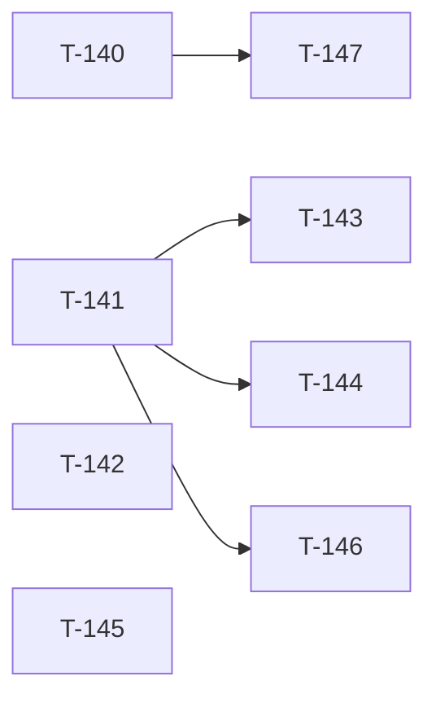

# Build Site — Batch 11 Nit-Pick Cleanup

Tiny follow-up to Batch 10 — addresses the 2 P2 + 4 P3 nits from the Batch 10 inspector report and the 2 cavekit clarifications it proposed.

**8 tasks across 2 tiers.**

---

## Tier 0 — Cavekit-driven changes (start here)

| Task | Title | Cavekit | Requirement | Effort |
|------|-------|---------|-------------|--------|
| T-140 | F-001: remove dead `e.stopPropagation()` and misleading comment from variant toggle handler | (code quality) | — | S |
| T-141 | F-005: simplify variant aria-label from `"kpi-tile <v> variant"` to `"<V> variant"` | cavekit-widgets.md | R4 | S |
| T-142 | R8 backslash exemption test: `0 1px 2px red\3b color: red` validates as ok and round-trips through CSS export as a single declaration | cavekit-schema.md | R8 (revised) | S |

---

## Tier 1 — Test sharpening

| Task | Title | Cavekit | Requirement | blockedBy | Effort |
|------|-------|---------|-------------|-----------|--------|
| T-143 | F-002: replace theatrical wrapper-only assertion with a static check that scans WidgetPreview.module.css and proves every theme color/shadow/radius slot is referenced via `var(--token)` somewhere | cavekit-widgets.md | R4 | T-141 | M |
| T-144 | F-003: replace loose `outerHTML !== outerHTML` comparison with specific `data-variant="metric"` attribute assertion | cavekit-widgets.md | R4 | T-141 | S |
| T-145 | F-004: split `toCSSVarsVariant` output on `:root[data-theme="dark"] {` and assert each new var appears in BOTH halves | cavekit-export.md | R2 | — | S |
| T-146 | F-006: add test asserting variant toggle renders + is interactive when kpi-tile selection is false | cavekit-widgets.md | R4 (revised) | T-141 | S |
| T-147 | Update existing F-001 regression test to remove the `stopPropagation`-specific intent (rename / reword) since the structural separation is what guarantees isolation, not propagation suppression | (test quality) | — | T-140 | S |

---

## Summary

| Tier | Tasks | Effort |
|------|-------|--------|
| 0 | 3 | 3S |
| 1 | 5 | 1M, 4S |

**Total: 8 tasks, 1M + 7S.**

---

## Coverage Matrix

| Origin | Item | Task(s) | Status |
|--------|------|---------|--------|
| Inspector F-001 (P2) | Dead stopPropagation removed | T-140, T-147 | COVERED |
| Inspector F-002 (P2) | Real WidgetPreview CSS-consumption assertion | T-143 | COVERED |
| Inspector F-003 (P3) | Specific data-variant assertion | T-144 | COVERED |
| Inspector F-004 (P3) | Dark-block-specific assertion in toCSSVarsVariant test | T-145 | COVERED |
| Inspector F-005 (P3) | aria-label phrasing simplified | T-141 | COVERED |
| Inspector F-006 (P3) | Toggle availability behavior codified + tested | T-146 + cavekit-widgets R4 revision | COVERED |
| Cavekit-schema R8 (revised) | Backslash exemption documented + tested | T-142 + cavekit-schema R8 revision | COVERED |
| Cavekit-widgets R4 (revised) | Toggle-availability acceptance criterion added | T-146 | COVERED |

**Coverage: 8/8 batch-11 items (100%). 0 GAP.**

---

## Dependency Graph

