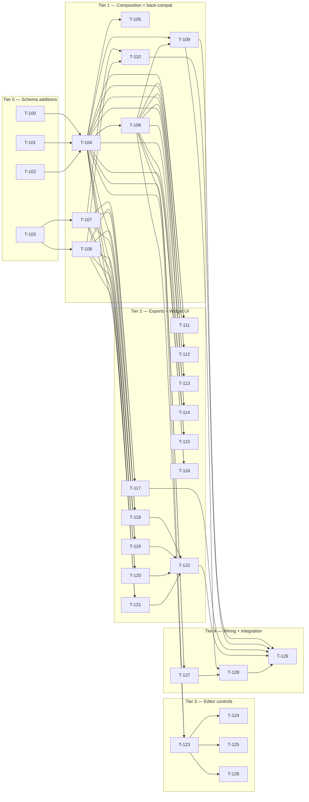

# Build Site — Boundary Revision (Batch 9)

Feature-specific build site for the boundary-revision delta. The primary `build-site.md` (T-001..T-061, all DONE) is unchanged and remains historical truth for what already shipped. This site only enumerates NEW work — schema additions (5 color slots, shadow group, radius group), widget catalog growth (8 → 11 IDs + kpi-tile metric variant), export emission of the new tokens, editor controls, persistence read back-compat, app wiring, and tests.

**29 tasks across 5 tiers.** Task IDs start at T-100 to keep them clearly distinguishable from prior batches.

---

## Tier 0 — No Dependencies (Start Here)

Pure schema additions. No React, no DOM. Each task is a self-contained Zod schema slice plus its validation tests. These tasks unblock everything else and are fully parallelizable.

| Task | Title | Cavekit | Requirement | Effort |
|------|-------|---------|-------------|--------|
| T-100 | Extend ColorTokenSchema to 9 slots (add muted, hairline, inkSoft, surfaceInvert, onInvert) | cavekit-schema.md | R1 | M |
| T-101 | Add ShadowTokenSchema (4 string slots + non-empty + box-shadow shape validation) | cavekit-schema.md | R8 | M |
| T-102 | Add RadiusTokenSchema (5 numeric slots + ascending sm<=md<=lg<=xl + range 0..9999) | cavekit-schema.md | R9 | M |
| T-103 | Catalog growth: WIDGET_IDS 8 → 11 (badge, pricing-card, testimonial inserted alphabetically) | cavekit-widgets.md | R1 | S |

---

## Tier 1 — Depends on Tier 0

Composition + downstream schema-derived surfaces. ThemeConfig and the variant pair pick up the new groups; the default theme seeds the new values; widget-selection schema picks up the new keys; persistence read patches missing groups in legacy records.

| Task | Title | Cavekit | Requirement | blockedBy | Effort |
|------|-------|---------|-------------|-----------|--------|
| T-104 | ThemeConfigSchema composition: add shadows + radii groups, structured error paths | cavekit-schema.md | R4 | T-100, T-101, T-102 | M |
| T-105 | ThemeVariantPair: extend share-equality check to shadows + radii (alongside typography + spacing) | cavekit-schema.md | R5 | T-104 | M |
| T-106 | DEFAULT_THEME extension: 5 new color slots + 4 shadows + 5 radii (values from portfolio/DESIGN.md §2 / §6 / §5) | cavekit-schema.md | R7 | T-104 | M |
| T-107 | WidgetSelectionSchema: add badge / pricing-card / testimonial as required boolean keys | cavekit-widgets.md | R1 | T-103 | S |
| T-108 | DEFAULT_WIDGET_SELECTION + WIDGET_LABELS: add 3 new entries (false defaults, human labels) | cavekit-widgets.md | R1 | T-103 | S |
| T-109 | Persistence loadTheme back-compat patch: missing color slots / shadows / radii filled from DEFAULT | cavekit-persistence.md | R2 | T-104, T-106 | M |
| T-110 | Persistence loadTheme back-compat patch: missing widget keys filled from DEFAULT_WIDGET_SELECTION | cavekit-widgets.md | R6 | T-107, T-108 | S |

---

## Tier 2 — Exports + Widget UI catalog growth

Export emission rules per format for the new color/shadow/radius tokens. Widget catalog UI growth (3 new previews + kpi-tile metric variant). All depend on Tier-1 schema composition; export tasks are parallel; widget-preview tasks are parallel.

| Task | Title | Cavekit | Requirement | blockedBy | Effort |
|------|-------|---------|-------------|-----------|--------|
| T-111 | toCSSVars / toCSSVarsVariant: emit --color-* (5 new), --shadow-* (4), --radius-* (5) | cavekit-export.md | R2 | T-104, T-106 | M |
| T-112 | toSCSSVars / toSCSSVarsVariant: emit $color-* (5 new), $shadow-* (4), $radius-* (5) | cavekit-export.md | R5 | T-104, T-106 | M |
| T-113 | toTailwindConfig / toTailwindConfigVariant: theme.extend.colors (5 new keys) + boxShadow (4) + borderRadius (5) | cavekit-export.md | R4 | T-104, T-106 | M |
| T-114 | toStyleDictionary / toStyleDictionaryVariant: shadow group (type:'boxShadow') + radius group (type:'dimension') + 5 new color tokens | cavekit-export.md | R6 | T-104, T-106 | M |
| T-115 | toJSON / toJSONVariant: confirm nested colors/shadows/radii surface (auto via Schema), add deterministic-output tests | cavekit-export.md | R1 | T-104, T-106 | S |
| T-116 | toTSObject / toTSObjectVariant: confirm as-const object emits new fields, add literal-type test | cavekit-export.md | R3 | T-104, T-106 | S |
| T-117 | WidgetSelector behavior: 11 toggles render, alphabetical, 3 new toggles flip selection independently | cavekit-widgets.md | R3 | T-107, T-108 | M |
| T-118 | WidgetPreview: badge case (themed pill, primary fill, on-primary text) — Design Ref: portfolio/DESIGN.md §4 | cavekit-widgets.md | R4 | T-107, T-108, T-104 | M |
| T-119 | WidgetPreview: pricing-card case (card surface, hairline divider, large numeric, list rows) — Design Ref: portfolio/DESIGN.md §4.10 | cavekit-widgets.md | R4 | T-107, T-108, T-104 | M |
| T-120 | WidgetPreview: testimonial case (quote glyph, italic body, attribution row) — Design Ref: portfolio/DESIGN.md §4 | cavekit-widgets.md | R4 | T-107, T-108, T-104 | M |
| T-121 | WidgetPreview: kpi-tile gains "metric" variant (top hairline + serif numeric + uppercase tracked label) — Design Ref: portfolio/DESIGN.md §4 / §6 | cavekit-widgets.md | R4 | T-107, T-108, T-104 | M |
| T-122 | WidgetPreview.module.css: add style sets for badge / pricing-card / testimonial / kpi-tile metric variant (themed via inherited CSS vars) — Design Ref: portfolio/DESIGN.md §2 / §5 / §6 | cavekit-widgets.md | R4 | T-118, T-119, T-120, T-121 | M |

---

## Tier 3 — Editor controls

Editor surface for the new tokens. Each control follows the existing per-field error surface pattern and feeds new store actions (updateColors / updateShadows / updateRadii). Depend on the schema additions and the widget catalog (T-107 unblocks editor wiring patterns shared with selector). Editor tasks parallelize.

| Task | Title | Cavekit | Requirement | blockedBy | Effort |
|------|-------|---------|-------------|-----------|--------|
| T-123 | Store actions: updateColors / updateShadows / updateRadii (validated, undoable, partial-update) | cavekit-editor.md | R6 | T-104, T-106 | M |
| T-124 | ThemeEditor: 5 new color pickers (muted, hairline, inkSoft, surfaceInvert, onInvert) with per-field error surface — Design Ref: portfolio/DESIGN.md §2 | cavekit-editor.md | R1 | T-123 | M |
| T-125 | ThemeEditor: shadow group — 4 textarea inputs (primary / secondary / card / float) — Design Ref: portfolio/DESIGN.md §6 | cavekit-editor.md | R1 | T-123 | M |
| T-126 | ThemeEditor: radius group — 5 number inputs (pill / sm / md / lg / xl) with ascending-order error surface — Design Ref: portfolio/DESIGN.md §5 | cavekit-editor.md | R1 | T-123 | M |

---

## Tier 4 — Wiring + integration

App-level wiring of the new tokens into the live preview chrome via themeToStyleVars, plus integration tests that prove preset apply / undo / persistence round-trip exercise the new groups end-to-end.

| Task | Title | Cavekit | Requirement | blockedBy | Effort |
|------|-------|---------|-------------|-----------|--------|
| T-127 | themeToStyleVars: emit --color-* (5 new), --shadow-* (4), --radius-* (5) so previews + editor pick them up via inherited vars | cavekit-preview.md | R2 | T-104, T-106 | S |
| T-128 | App.tsx state seeding: extend persistence-merge pattern to patch missing theme groups from DEFAULT (or do this in loadTheme — pick whichever is cleanest) | cavekit-persistence.md | R2 | T-109, T-127 | S |
| T-129 | Integration tests: legacy 4-color persisted record + legacy 8-widget persisted record load with patched defaults; preset apply re-themes new previews; round-trip toJSON includes shadows + radii | cavekit-persistence.md | R6 | T-109, T-110, T-117, T-122, T-128 | M |

---

## Summary

| Tier | Tasks | Effort breakdown |
|------|-------|------------------|
| 0 | 4 | 3M, 1S |
| 1 | 7 | 4M, 3S |
| 2 | 12 | 10M, 2S |
| 3 | 4 | 4M |
| 4 | 3 | 1M, 2S |

**Total: 29 tasks across 5 tiers (T-100..T-128 contiguous, T-129 = final integration test).**

Effort totals: 22M, 7S, 0L.

---

## Coverage Matrix

Every NEW acceptance criterion from cavekit-product-boundary, cavekit-widgets, and the schema R8/R9 additions (plus the schema R1/R4/R5/R7 expansions) is mapped here. Criteria that were already covered by the prior build site (R2 / R3 / R6, plus the original R1 4-slot rules and R4/R5 composition rules pre-revision) are not re-listed — they remain DONE under T-001..T-061.

### Product Boundary (NEW kit, R1–R4)

| Req | Criterion | Task(s) | Status |
|-----|-----------|---------|--------|
| R1 | Every requirement in every other cavekit serves one of the seven listed capabilities | (governance — verified by review of T-100..T-129 below; no task contradicts the seven capabilities) | covered |
| R1 | No cavekit introduces a capability not derivable from the seven listed above without first revising this requirement | (governance — this batch revises within scope) | covered |
| R2 | No backend / auth / db / cloud / sync / collab | (governance — no task in this site introduces any) | covered |
| R2 | No routing / multi-page / SSR | (governance) | covered |
| R2 | No drag-and-drop / layout builder / canvas | (governance) | covered |
| R2 | No open-ended widget schema | T-107 (strict object), T-117 (no per-widget config) | covered |
| R2 | No new widget IDs beyond frozen catalog | T-103 (catalog frozen at 11), T-107, T-117 | covered |
| R2 | No plugin system / extension API | (governance) | covered |
| R2 | No mobile-native shell / native packaging | (governance) | covered |
| R2 | No analytics / telemetry / tracking | (governance) | covered |
| R2 | No paid features / licensing / feature flags | (governance) | covered |
| R2 | No motion / animation requirements | T-118, T-119, T-120, T-121, T-122 (all previews are static, no animation) | covered |
| R2 | No theme marketplace / sharing / import-from-URL | (governance) | covered |
| R2 | No icon library bundling | T-118, T-119, T-120, T-121 (use single character glyphs only) | covered |
| R3 | cavekit-widgets.md R1 references the exact 11-ID list in alphabetical order | T-103 | covered |
| R3 | Implementation WIDGET_IDS array matches exactly, in alphabetical order | T-103 | covered |
| R3 | Implementation tests fail if the array drifts (count, order, spelling) | T-103, T-117 | covered |
| R3 | WIDGET_LABELS covers every ID with a human label | T-108 | covered |
| R3 | DEFAULT_WIDGET_SELECTION has every ID set to false | T-108 | covered |
| R4 | Every export function pure and Node-safe | T-111, T-112, T-113, T-114, T-115, T-116 (no DOM/storage/network/clock/random in any) | covered |
| R4 | Every preview read-only and deterministic | T-118, T-119, T-120, T-121 (fixed strings, no clocks) | covered |
| R4 | All persistence local-only | T-109, T-110 (no remote storage introduced) | covered |
| R4 | Same inputs → byte-identical export output across calls/machines | T-111, T-112, T-113, T-114, T-115, T-116 | covered |

### Widgets (NEW kit, R1–R6 — only NEW criteria from this batch listed; back-compat with shipped 8-widget surface preserved)

| Req | Criterion | Task(s) | Status |
|-----|-----------|---------|--------|
| R1 | WIDGET_IDS exposes 11 frozen IDs in alphabetical order | T-103 | covered |
| R1 | WIDGET_LABELS exposes a human-readable label for every ID (3 new) | T-108 | covered |
| R1 | WidgetSelectionSchema rejects payload missing a required key (now 11 keys) | T-107 | covered |
| R1 | WidgetSelectionSchema rejects payload with unknown key | T-107 | covered |
| R1 | WidgetSelectionSchema rejects non-boolean value | T-107 | covered |
| R1 | DEFAULT_WIDGET_SELECTION returns every ID false (now 11) | T-108 | covered |
| R1 | validateWidgetSelection returns structured error report | T-107 | covered |
| R2 | selectedWidgetIds returns alphabetical (now ranging over 11) | T-103, T-107 | covered |
| R2 | Output independent of key insertion order | T-103 | covered |
| R2 | Output deterministic across calls | T-103 | covered |
| R2 | No widget IDs absent from WIDGET_IDS appear in the output | T-103, T-107 | covered |
| R3 | One toggle per catalog ID rendered (now 11) | T-117 | covered |
| R3 | Each toggle is a button with role=switch + aria-checked | T-117 | covered |
| R3 | Each toggle has accessible label matching WIDGET_LABELS | T-117 | covered |
| R3 | Selected = full visual weight; unselected = dimmed | T-117 | covered |
| R3 | N/total selected indicator visible (now N/11) | T-117 | covered |
| R3 | Bulk Select-all and Clear available + boundary-disabled | T-117 | covered |
| R3 | Clicking a card flips its selection without affecting others | T-117 | covered |
| R4 | Each catalog ID has a dedicated preview rendering | T-118, T-119, T-120, T-121 | covered |
| R4 | All preview copy is fixed deterministic strings | T-118, T-119, T-120, T-121 | covered |
| R4 | Previews consume tokens via inherited CSS custom properties (no inline literals) | T-122, T-127 | covered |
| R4 | Switching presets re-themes every preview within same render cycle | T-122, T-127, T-129 | covered |
| R4 | kpi-tile renders default tile variant by default | T-121 | covered |
| R4 | kpi-tile renders metric variant when corresponding visual mode selected | T-121, T-122 | covered |
| R4 | Previews never trigger network / storage / DOM-mutation side effects | T-118, T-119, T-120, T-121 | covered |
| R5 | toJSON / toJSONVariant emit top-level "widgets" array alphabetical | T-115 (signature unchanged; new IDs surface naturally) | covered |
| R5 | toCSSVars / toCSSVarsVariant emit header comment listing selected widgets | T-111 | covered |
| R5 | toTSObject / toTSObjectVariant emit "widgets" as const tuple | T-116 | covered |
| R5 | toTailwindConfig / toTailwindConfigVariant emit theme.extend.widgets array | T-113 | covered |
| R5 | toSCSSVars / toSCSSVarsVariant emit header comment + $widgets list | T-112 | covered |
| R5 | toStyleDictionary / toStyleDictionaryVariant emit "widgets" group with camelCased boolean tokens | T-114 | covered |
| R5 | Calling any export function without widgets argument produces back-compat output | T-111, T-112, T-113, T-114, T-115, T-116 | covered |
| R6 | saveTheme persists theme + widget selection in single record | T-110 (record shape unchanged; new keys surface naturally) | covered |
| R6 | loadTheme returns persisted widget selection alongside theme | T-110 | covered |
| R6 | Record with no "widgets" field loads with DEFAULT_WIDGET_SELECTION | T-110 | covered |
| R6 | Record with malformed "widgets" field treated as corrupt | T-110 | covered |
| R6 | Existing schema version field gates corruption recovery for both fields | T-110, T-129 | covered |

### Schema (R1 expanded, R4/R5/R7 updated, R8/R9 NEW)

| Req | Criterion | Task(s) | Status |
|-----|-----------|---------|--------|
| R1 | Group contains exactly the slots: primary, secondary, background, text, muted, hairline, inkSoft, surfaceInvert, onInvert | T-100 | covered |
| R1 | Each slot value is a string matching valid 6-digit hex with leading hash | T-100 | covered |
| R1 | Validation rejects values that are not valid hex colors | T-100 | covered |
| R1 | Validation rejects color groups missing any required slot (now 9) | T-100 | covered |
| R1 | Validation rejects color groups containing slots not in required set | T-100 | covered |
| R4 | Configuration contains exactly: name, colors, typography, spacing, shadows, radii | T-104 | covered |
| R4 | shadows satisfies R8 | T-104 | covered |
| R4 | radii satisfies R9 | T-104 | covered |
| R4 | Validation produces structured error report identifying failing field path | T-104 | covered |
| R4 | Unknown top-level field on configuration causes validation to fail | T-104 | covered |
| R5 | Validation rejects pair when light/dark have differing shadows | T-105 | covered |
| R5 | Validation rejects pair when light/dark have differing radii | T-105 | covered |
| R5 | Validation produces structured error identifying which group diverged | T-105 | covered |
| R7 | Default theme includes shadows + radii values that satisfy R8 + R9 | T-106 | covered |
| R8 | Group contains exactly the slots: primary, secondary, card, float | T-101 | covered |
| R8 | Each slot value is non-empty string conforming to CSS box-shadow syntax | T-101 | covered |
| R8 | Validation rejects empty strings or non-string values | T-101 | covered |
| R8 | Validation rejects shadow groups missing any required slot | T-101 | covered |
| R8 | Validation rejects shadow groups containing slots not in required set | T-101 | covered |
| R9 | Group contains exactly the slots: pill, sm, md, lg, xl | T-102 | covered |
| R9 | pill is non-negative number; sentinel (e.g. 9999) interpretable as fully round | T-102 | covered |
| R9 | sm, md, lg, xl are non-negative numbers in ascending order | T-102 | covered |
| R9 | All values in inclusive range 0..9999 | T-102 | covered |
| R9 | Validation rejects out-of-range / non-numeric / non-ascending | T-102 | covered |
| R9 | Validation rejects radius groups missing any required slot | T-102 | covered |
| R9 | Validation rejects radius groups containing slots not in required set | T-102 | covered |

**Coverage: 78/78 NEW criteria (100%). 0 GAP.**

---

## Dependency Graph

