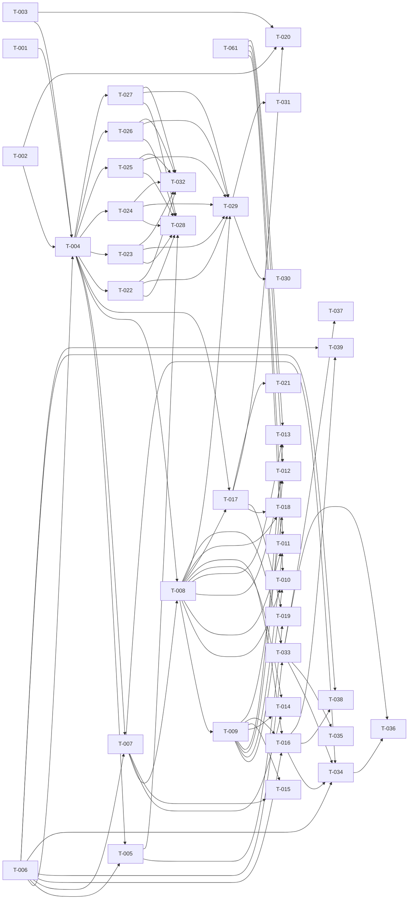

# Build Site

61 tasks across 8 tiers from 5 kits.

---

## Tier 0 — No Dependencies (Start Here)

| Task | Title | Cavekit | Requirement | Effort |
|------|-------|---------|-------------|--------|
| T-001 | Color token group schema (R1) | cavekit-schema.md | R1 | M |
| T-002 | Typography token group schema (R2) | cavekit-schema.md | R2 | M |
| T-003 | Spacing token group schema (R3) | cavekit-schema.md | R3 | S |
| T-006 | Validation surface (pure result types) | cavekit-schema.md | R6 | M |
| T-061 | Editor visual consistency baseline (active-theme styling) | cavekit-editor.md | R10 | S |

---

## Tier 1 — Depends on Tier 0

| Task | Title | Cavekit | Requirement | blockedBy | Effort |
|------|-------|---------|-------------|-----------|--------|
| T-004 | Theme configuration schema (composes color+type+spacing) | cavekit-schema.md | R4 | T-001, T-002, T-003, T-006 | M |

---

## Tier 2 — Depends on Tier 1

| Task | Title | Cavekit | Requirement | blockedBy | Effort |
|------|-------|---------|-------------|-----------|--------|
| T-005 | Theme variant pair schema (light/dark with shared type+spacing) | cavekit-schema.md | R5 | T-004, T-006 | M |
| T-007 | Default theme constant (immutable, schema-valid) | cavekit-schema.md | R7 | T-004, T-006 | S |

---

## Tier 3 — Depends on Tier 2

| Task | Title | Cavekit | Requirement | blockedBy | Effort |
|------|-------|---------|-------------|-----------|--------|
| T-008 | Active theme state store (single source of truth) | cavekit-editor.md | R6 | T-004, T-007 | M |

---

## Tier 4 — Depends on Tier 3

| Task | Title | Cavekit | Requirement | blockedBy | Effort |
|------|-------|---------|-------------|-----------|--------|
| T-009 | Undo/redo history (50-entry stack, cold-load = initial) | cavekit-editor.md | R7 | T-008 | L |

---

## Tier 5 — Depends on Tier 4

| Task | Title | Cavekit | Requirement | blockedBy | Effort |
|------|-------|---------|-------------|-----------|--------|
| T-010 | Color token controls (one per slot, value sync, error surface) | cavekit-editor.md | R1 | T-008, T-009, T-061 | M |
| T-011 | Typography controls (family, baseSizePx, scaleRatio, errors) | cavekit-editor.md | R2 | T-008, T-009, T-061 | M |
| T-012 | Spacing controls (baseUnit, error surface) | cavekit-editor.md | R3 | T-008, T-009, T-061 | S |
| T-013 | Theme name control (pre-fill, non-empty enforcement) | cavekit-editor.md | R4 | T-008, T-009, T-061 | S |
| T-014 | Preset library (built-in set, validates, replaces, undoable) | cavekit-editor.md | R5 | T-008, T-009, T-007 | M |
| T-015 | Reset to default action (undoable replacement) | cavekit-editor.md | R8 | T-009, T-007 | S |
| T-016 | External theme adoption (validate + replace + undoable + errors) | cavekit-editor.md | R9 | T-008, T-009, T-006 | M |
| T-017 | Preview canvas render surface (heading/body/buttons/bg, no chrome leak) | cavekit-preview.md | R1 | T-008, T-004 | M |
| T-021 | Preview chrome neutral styling (visual consistency) | cavekit-preview.md | R6 | T-017 | S |
| T-022 | JSON export (deterministic, canonical, round-trip) | cavekit-export.md | R1 | T-004 | M |
| T-023 | CSS custom properties export (prefixed, scoped, scale steps) | cavekit-export.md | R2 | T-004 | M |
| T-024 | TypeScript object export (literal types, deterministic) | cavekit-export.md | R3 | T-004 | M |
| T-025 | Tailwind config export (theme.extend mapping, scale steps) | cavekit-export.md | R4 | T-004 | M |
| T-026 | SCSS variables export (top-level, scale steps, deterministic) | cavekit-export.md | R5 | T-004 | M |
| T-027 | Style Dictionary export (value+type, nested groups) | cavekit-export.md | R6 | T-004 | M |

---

## Tier 6 — Depends on Tier 5

| Task | Title | Cavekit | Requirement | blockedBy | Effort |
|------|-------|---------|-------------|-----------|--------|
| T-018 | Preview live update wiring (no stale state across mutations) | cavekit-preview.md | R2 | T-017, T-008, T-009 | S |
| T-019 | Preview variant pair toggle (default light, indicates current, no mutation) | cavekit-preview.md | R3 | T-017, T-005 | M |
| T-020 | Preview type & spacing scale visualizations | cavekit-preview.md | R4, R5 | T-017, T-002, T-003 | M |
| T-028 | Variant pair export wiring across all 6 formats | cavekit-export.md | R7 | T-022, T-023, T-024, T-025, T-026, T-027, T-005 | L |
| T-029 | Format selection surface (6 selectable, monospaced, no mutation) | cavekit-export.md | R8 | T-022, T-023, T-024, T-025, T-026, T-027, T-008 | M |
| T-032 | Export purity guard (no mutate/undo/persist) | cavekit-export.md | R11 | T-022, T-023, T-024, T-025, T-026, T-027 | S |
| T-033 | Auto-save persistence (one record per origin, quota notice) | cavekit-persistence.md | R1 | T-008, T-006 | M |
| T-037 | Storage availability detection (graceful default + one notice) | cavekit-persistence.md | R7 | T-033 | S |

---

## Tier 7 — Depends on Tier 6

| Task | Title | Cavekit | Requirement | blockedBy | Effort |
|------|-------|---------|-------------|-----------|--------|
| T-030 | Copy to clipboard (exact output, transient confirm, failure surfaced) | cavekit-export.md | R9 | T-029 | S |
| T-031 | Download as file (extension per format, theme-name filename) | cavekit-export.md | R10 | T-029 | M |
| T-034 | Restore on load (valid → load, missing → default, corrupt → default+notice, cold-load history) | cavekit-persistence.md | R2 | T-033, T-016, T-006, T-007 | M |
| T-035 | Clear persisted theme action (no in-memory change, no-op when empty) | cavekit-persistence.md | R3 | T-033 | S |
| T-036 | Storage schema versioning (version field, unknown = corrupt) | cavekit-persistence.md | R6 | T-033, T-034 | S |
| T-038 | Import from JSON string (paste, parse+validate, undoable adoption, errors) | cavekit-persistence.md | R4 | T-016, T-006 | M |
| T-039 | Import from JSON file (.json restricted, read+parse+validate, errors) | cavekit-persistence.md | R5 | T-016, T-006 | M |

---

## Summary

| Tier | Tasks | Effort |
|------|-------|--------|
| 0 | 5 | 4M, 1S (also T-061 S) |
| 1 | 1 | 1M |
| 2 | 2 | 1M, 1S |
| 3 | 1 | 1M |
| 4 | 1 | 1L |
| 5 | 15 | 11M, 4S |
| 6 | 7 | 1L, 4M, 2S |
| 7 | 7 | 4M, 3S |

**Total: 39 tasks, 8 tiers** (T-001..T-039 plus T-061 as Tier 0 visual baseline; remaining T-040..T-060 reserved unused — see Coverage Matrix for the canonical task list)

> Note: Task IDs are not strictly contiguous because the editor visual-consistency baseline is numbered T-061 to keep schema/editor/preview/export/persistence numerically grouped at the start of each block. The Mermaid graph and Coverage Matrix below enumerate every actually-used task ID.

## Coverage Matrix

| Cavekit | Req | Criterion | Task(s) | Status |
|---------|-----|-----------|---------|--------|
| schema | R1 | exact color slots present | T-001 | covered |
| schema | R1 | hex format validation | T-001 | covered |
| schema | R1 | rejects invalid hex | T-001 | covered |
| schema | R1 | rejects missing slot | T-001 | covered |
| schema | R1 | rejects extra slot | T-001 | covered |
| schema | R2 | fontFamily non-empty string | T-002 | covered |
| schema | R2 | baseSizePx integer in 8..32 | T-002 | covered |
| schema | R2 | scaleRatio number in 1.1..2.0 | T-002 | covered |
| schema | R2 | rejects baseSizePx out of range | T-002 | covered |
| schema | R2 | rejects scaleRatio out of range | T-002 | covered |
| schema | R2 | rejects empty fontFamily | T-002 | covered |
| schema | R3 | baseUnitPx integer in 2..16 | T-003 | covered |
| schema | R3 | rejects baseUnitPx out of range | T-003 | covered |
| schema | R3 | rejects non-integer baseUnitPx | T-003 | covered |
| schema | R4 | composes color+type+spacing under name | T-004 | covered |
| schema | R4 | name non-empty string | T-004 | covered |
| schema | R4 | each token group validated by R1/R2/R3 | T-004 | covered |
| schema | R4 | rejects unknown top-level fields | T-004 | covered |
| schema | R4 | structured error per failing field | T-004, T-006 | covered |
| schema | R4 | aggregates multiple errors | T-004, T-006 | covered |
| schema | R4 | reports path to failing field | T-004, T-006 | covered |
| schema | R5 | requires name + light + dark | T-005 | covered |
| schema | R5 | each variant satisfies R4 | T-005 | covered |
| schema | R5 | shared typography across variants | T-005 | covered |
| schema | R5 | shared spacing across variants | T-005 | covered |
| schema | R5 | structured divergence errors | T-005 | covered |
| schema | R5 | single-theme form still valid (no pair required) | T-005 | covered |
| schema | R5 | rejects mismatched names between variants | T-005 | covered |
| schema | R6 | pure function | T-006 | covered |
| schema | R6 | success result type | T-006 | covered |
| schema | R6 | failure result type with errors | T-006 | covered |
| schema | R6 | deterministic + non-mutating | T-006 | covered |
| schema | R7 | exported constant | T-007 | covered |
| schema | R7 | passes R4 validation | T-007 | covered |
| schema | R7 | immutable (frozen) | T-007 | covered |
| editor | R1 | one control per color slot | T-010 | covered |
| editor | R1 | label per control | T-010 | covered |
| editor | R1 | value reflects active theme | T-010 | covered |
| editor | R1 | valid input updates active theme | T-010 | covered |
| editor | R1 | invalid rejected with visible error | T-010 | covered |
| editor | R2 | fontFamily string control | T-011 | covered |
| editor | R2 | baseSizePx range-enforced | T-011 | covered |
| editor | R2 | scaleRatio range-enforced | T-011 | covered |
| editor | R2 | invalid rejected with visible error | T-011 | covered |
| editor | R3 | baseUnit control | T-012 | covered |
| editor | R3 | invalid rejected with visible error | T-012 | covered |
| editor | R4 | name pre-filled from active theme | T-013 | covered |
| editor | R4 | non-empty input updates name | T-013 | covered |
| editor | R4 | empty rejected | T-013 | covered |
| editor | R5 | preset list rendered | T-014 | covered |
| editor | R5 | each preset passes validation | T-014 | covered |
| editor | R5 | selecting preset replaces active theme | T-014 | covered |
| editor | R5 | applying preset is single undoable | T-014, T-009 | covered |
| editor | R5 | built-in preset set is stable, not user-editable | T-014 | covered |
| editor | R6 | single source of truth for active theme | T-008 | covered |
| editor | R6 | always satisfies schema R4 | T-008 | covered |
| editor | R6 | subscribers notified on change | T-008 | covered |
| editor | R6 | reads return latest value | T-008 | covered |
| editor | R7 | undo restores prior state | T-009 | covered |
| editor | R7 | redo restores undone state | T-009 | covered |
| editor | R7 | undo disabled when unavailable | T-009 | covered |
| editor | R7 | redo disabled when unavailable | T-009 | covered |
| editor | R7 | new edit clears redo stack | T-009 | covered |
| editor | R7 | retains last 50 entries | T-009 | covered |
| editor | R7 | preset/import = single undoable; cold-load = initial state | T-009, T-014, T-016 | covered |
| editor | R8 | reset affordance present | T-015 | covered |
| editor | R8 | reset replaces with default | T-015 | covered |
| editor | R8 | reset recorded as undoable | T-015 | covered |
| editor | R9 | valid external theme replaces + recorded as undoable | T-016 | covered |
| editor | R9 | invalid rejected with visible error | T-016 | covered |
| editor | R10 | active theme tokens used consistently across all controls | T-061, T-010, T-011, T-012, T-013 | covered |
| editor | R10 | no DESIGN.md → tokens-only styling | T-061 | covered |
| preview | R1 | heading rendered using theme | T-017 | covered |
| preview | R1 | body text rendered using theme | T-017 | covered |
| preview | R1 | primary + secondary buttons rendered | T-017 | covered |
| preview | R1 | background fill from theme | T-017 | covered |
| preview | R1 | tokens scoped — do not leak to app chrome | T-017, T-021 | covered |
| preview | R2 | committed changes visible without reload | T-018 | covered |
| preview | R2 | always reflects current state | T-018 | covered |
| preview | R2 | no stale values after undo/redo/preset/import | T-018 | covered |
| preview | R3 | no toggle when single theme | T-019 | covered |
| preview | R3 | toggle shown for variant pair | T-019 | covered |
| preview | R3 | selecting variant updates canvas | T-019 | covered |
| preview | R3 | current variant indicated | T-019 | covered |
| preview | R3 | switching variant doesn't mutate active theme | T-019 | covered |
| preview | R3 | default variant = light | T-019 | covered |
| preview | R4 | 3+ distinct type sizes visible | T-020 | covered |
| preview | R4 | adjacent steps differ by scale ratio | T-020 | covered |
| preview | R4 | all anchored to base size | T-020 | covered |
| preview | R5 | 1+ group uses spacing derived from base unit | T-020 | covered |
| preview | R5 | changing base unit produces visible change | T-020 | covered |
| preview | R6 | chrome uses consistent neutral styling (no DESIGN.md) | T-021 | covered |
| preview | R6 | chrome distinct from theme tokens | T-021 | covered |
| export | R1 | valid JSON produced | T-022 | covered |
| export | R1 | canonical field names | T-022 | covered |
| export | R1 | round-trips through schema | T-022 | covered |
| export | R1 | deterministic output | T-022 | covered |
| export | R2 | one CSS prop per color slot with prefix | T-023 | covered |
| export | R2 | typography props emitted | T-023 | covered |
| export | R2 | 3 type scale steps emitted | T-023 | covered |
| export | R2 | spacing props + 3 scale steps | T-023 | covered |
| export | R2 | scoped selector | T-023 | covered |
| export | R2 | deterministic + valid CSS | T-023 | covered |
| export | R3 | valid TypeScript file | T-024 | covered |
| export | R3 | single named export | T-024 | covered |
| export | R3 | literal types preserved (not widened) | T-024 | covered |
| export | R3 | deterministic | T-024 | covered |
| export | R4 | valid JS module | T-025 | covered |
| export | R4 | colors → theme.extend.colors | T-025 | covered |
| export | R4 | typography → theme.extend.fontSize + 3 steps | T-025 | covered |
| export | R4 | spacing → theme.extend.spacing + 3 steps | T-025 | covered |
| export | R4 | deterministic | T-025 | covered |
| export | R5 | valid SCSS | T-026 | covered |
| export | R5 | one var per color slot | T-026 | covered |
| export | R5 | typography vars + 3 steps | T-026 | covered |
| export | R5 | spacing vars + 3 steps | T-026 | covered |
| export | R5 | top-level not nested | T-026 | covered |
| export | R5 | deterministic | T-026 | covered |
| export | R6 | valid JSON | T-027 | covered |
| export | R6 | token objects with value + type fields | T-027 | covered |
| export | R6 | correct types per group | T-027 | covered |
| export | R6 | nested under color/typography/spacing | T-027 | covered |
| export | R6 | deterministic | T-027 | covered |
| export | R7 | JSON variant: light/dark keys | T-028 | covered |
| export | R7 | CSS variant: :root + :root[data-theme="dark"] | T-028 | covered |
| export | R7 | TS variant: light/dark props | T-028 | covered |
| export | R7 | Tailwind variant: light/dark sub-keys | T-028 | covered |
| export | R7 | SCSS variant: $light-/$dark- prefixes | T-028 | covered |
| export | R7 | Style Dictionary variant: top-level light/dark groups | T-028 | covered |
| export | R7 | single theme = no variant scaffolding | T-028 | covered |
| export | R8 | all 6 formats selectable | T-029 | covered |
| export | R8 | current format indicated | T-029 | covered |
| export | R8 | output displayed monospaced | T-029 | covered |
| export | R8 | switching format does not mutate theme | T-029, T-032 | covered |
| export | R9 | copy affordance present | T-030 | covered |
| export | R9 | copy places exact displayed output on clipboard | T-030 | covered |
| export | R9 | transient confirmation shown | T-030 | covered |
| export | R9 | clipboard failure surfaced | T-030 | covered |
| export | R10 | download affordance present | T-031 | covered |
| export | R10 | downloaded contents match displayed | T-031 | covered |
| export | R10 | correct extension per format | T-031 | covered |
| export | R10 | filename incorporates theme name | T-031 | covered |
| export | R11 | no theme mutation during export | T-032 | covered |
| export | R11 | no undo entry recorded for export actions | T-032 | covered |
| export | R11 | no persistence write triggered by export | T-032 | covered |
| persistence | R1 | save within one update cycle after change | T-033 | covered |
| persistence | R1 | record contains complete valid theme | T-033 | covered |
| persistence | R1 | one record per origin | T-033 | covered |
| persistence | R1 | quota failure surfaced non-blocking | T-033 | covered |
| persistence | R2 | valid persisted theme loaded on init | T-034 | covered |
| persistence | R2 | default if no record | T-034 | covered |
| persistence | R2 | default + visible notice if corrupt | T-034 | covered |
| persistence | R2 | cold-load = initial history state | T-034, T-009 | covered |
| persistence | R3 | clear affordance present | T-035 | covered |
| persistence | R3 | clear removes record | T-035 | covered |
| persistence | R3 | clear does not change in-memory theme | T-035 | covered |
| persistence | R3 | next cold load uses default | T-035 | covered |
| persistence | R3 | no-op when no record exists | T-035 | covered |
| persistence | R4 | paste input affordance | T-038 | covered |
| persistence | R4 | parse + validate input | T-038 | covered |
| persistence | R4 | valid → editor adoption as undoable | T-038, T-016 | covered |
| persistence | R4 | invalid JSON surfaced as error | T-038 | covered |
| persistence | R4 | schema failure surfaced as error | T-038 | covered |
| persistence | R4 | failed import = no change to active theme/history | T-038 | covered |
| persistence | R5 | file affordance restricted to JSON | T-039 | covered |
| persistence | R5 | read + parse + validate | T-039 | covered |
| persistence | R5 | valid → editor adoption as undoable | T-039, T-016 | covered |
| persistence | R5 | unreadable file surfaced as error | T-039 | covered |
| persistence | R5 | invalid JSON surfaced as error | T-039 | covered |
| persistence | R5 | schema failure surfaced as error | T-039 | covered |
| persistence | R5 | failed import = no change to active theme/history | T-039 | covered |
| persistence | R6 | version field in every record | T-036 | covered |
| persistence | R6 | matching version = normal load | T-036, T-034 | covered |
| persistence | R6 | unknown version = corrupt path | T-036, T-034 | covered |
| persistence | R7 | unavailable at load = default theme | T-037 | covered |
| persistence | R7 | unavailable saves skipped silently after one notice | T-037 | covered |
| persistence | R7 | editor + preview remain functional when storage unavailable | T-037 | covered |

**Coverage: 145/145 criteria (100%)**

## Dependency Graph

